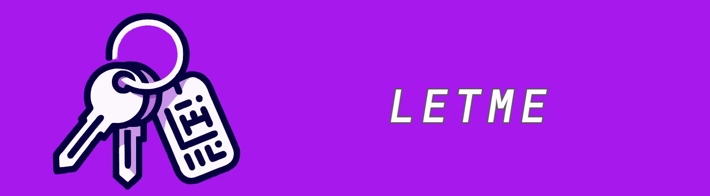

# letme [](https://goreportcard.com/report/github.com/lockedinspace/letme-go) [](https://pkg.go.dev/github.com/lockedinspace/letme) [](https://opensource.org/licenses/MIT) 


<p align="center">A <b>reliable</b>, <b>secure</b> and <b>fast</b> way to switch between AWS accounts from the CLI. </p>

## Documentation

Learn more about letme: [visit the complete and most up-to-date documentation](https://www.getletme.com/).

## Why letme
As AWS cloud administrators, we have found that:

1. **It is not easy to manage** credentials for different accounts and **follow AWS best practices** at the same time.
   
2. There is no common way to define the process of obtaining/updating/managing those credentials, **we wanted a centralized way to manage credentials**.

3. No more _"On my local computer works."_ since we implemented a centralized way to obtain and manage credentials.

## Requirements

- Go (+1.22).
- AWS CLI (v2).

## Install Letme

- [Through go cli (recommended)](#go-cli)
- [Building from source](#building-from-source)
  
### Go CLI

Install the latest letme version with:

```bash
go install github.com/lockedinspace/letme@latest
```
> [Where does go install the binary?](https://pkg.go.dev/cmd/go#hdr-Compile_and_install_packages_and_dependencies)

You can also install a specific version swapping ``@latest`` with your desired version.

Available versions can be found as [releases](https://github.com/lockedinspace/letme/releases). 


### Building from source

Clone the repository

```bash
git clone git@github.com:lockedinspace/letme.git
```

Change directory to letme and build the binary:

```bash
cd letme/
go build 
```

Move the ``letme`` binary to one of your ``$PATH`` (linux-macos) / ``$env:PATH`` (windows-poweshell) locations.

