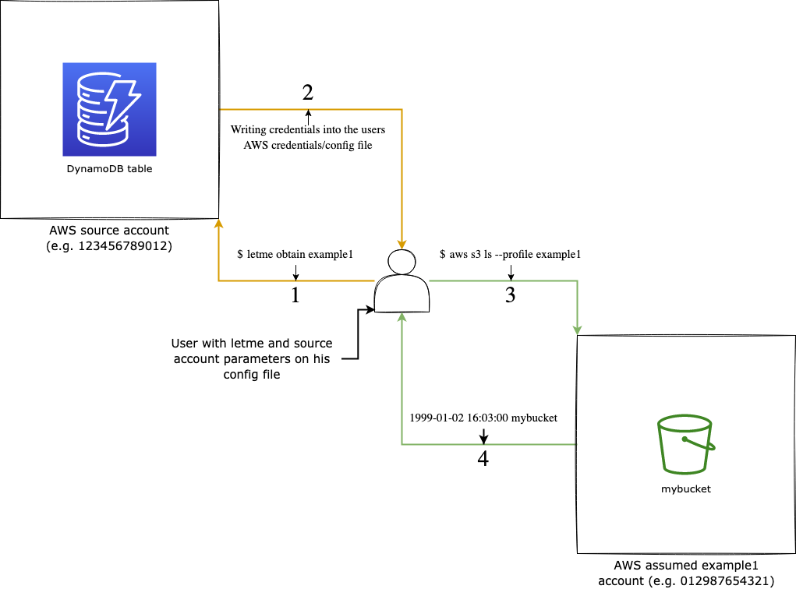

# letme [](https://goreportcard.com/report/github.com/lockedinspace/letme-go) [](https://opensource.org/licenses/MIT) [](https://pkg.go.dev/github.com/lockedinspace/letme)

## Requirements
- Go (recommended 1.19 or >= 1.16) installed in your system.
## What letme achieves
letme is a tool to obtain AWS credentials from another account. 
It only requires a central AWS account with a DynamoDB table to store all of the other accounts information.

It is also mantained and developed under the following statement:

- A simple automation which writes/updates AWS credentials under your AWS files.

This achieves a lightweight, fast and not-intrusive tool that only reads from a DynamoDB database, authenticates the user (if MFA is enabled and AWS authorizes the assume role request) and adds the successful credentials into (``$HOME/.aws/credentials`` and ``$HOME/.aws/config``).

Later on, you can append the  ``--profile example1`` to your AWS cli operations and call resources from within example1's AWS account.

## What it is not
As you can see, letme just updates your AWS files with the requested credentials.

This software is not intended for:
- Securing your AWS files, letme just reads and writes to them. You are responsable to secure them.
- If the server which is running the letme binary is shared amongst other users/processes, you should restrict access to only the required users/processes.
- Securing the AWS side (requiring MFA in your trust relationships, using a role with the least amount of privileges, etc.)

## Setup
There are two possible scenarios, either you just want to [install letme](#installing-letme) or you need to [set up the aws infrastructure](#setting-up-the-aws-infrastructure-required-by-letme). 

### Installing letme
Review the requirements and install letme with the command ``go install github.com/lockedinspace/letme@latest``. Go will automatically install it in your ``$GOPATH/bin`` directory which should be in your ``$PATH``.

### Installing letme from source
If you wish to install from source, clone the repository and build the executable with ``go build``. Afterwards, you must place the binary into your ``$PATH``.  
This repository uses a ``go mod`` file, so don't git clone inside your ``$GOPATH``.

### Setting up letme
You will use a configuration file where values such as MFA device arn, DynamoDB table will be stated. A letme config file template looks like:
```
[general]
  aws_source_profile = "default"
  aws_source_profile_region = "eu-west-1"
  dynamodb_table = "mytable"
  mfa_arn = "arn:aws:iam::123456789012:mfa/user001"
  session_name = "user001-with-letme"
```

Run ``letme config-file`` to generate your empty template.

Where:
| Key | Description | Default value | Required | Type |
| ------ | ------ | ------ | ------ | ------ |
| ``aws_source_profile`` | The source AWS profile name which stores the credentials from the source account. The source account stores the DynamoDB table as well as being the principal which the AWS assumed account accepts  [1] | ``default`` | No | ``string`` |
| ``aws_source_profile_region`` | The region name on the source account where the DynamoDB table is located [2] | ``-`` | Yes | ``string`` |
| ``dynamodb_table`` | The table name where the AWS accounts (name, role arns, regions, etc.) are stored | ``-`` | Yes | ``string`` |
| ``mfa_arn`` | The AWS MFA device arn where you will use to authenticate against AWS [3]  | ``-`` | No (depending on your AWS trust relationship policy) | ``string`` |
| ``session_name`` | The session name which letme will use when assuming a role from another account | ``${account_name}-letme-session`` | No | ``string`` |

[1] -> https://docs.aws.amazon.com/IAM/latest/UserGuide/reference_policies_elements_principal.html

[2] -> https://docs.aws.amazon.com/AWSEC2/latest/UserGuide/using-regions-availability-zones.html

[3] -> https://docs.aws.amazon.com/cli/latest/reference/iam/list-mfa-devices.html

### Setting up the AWS infrastructure required by letme

If you want to start using letme under your organization, you must deploy one DynamoDB table under the "source account" which will be the one
hosting the whole central database for your organization. 

Take a look at the following simplified diagram and understand why a DynamoDB table is required in order to provide a central and reliable source of trust amongst all of your organization peers.




Here's a more detailed workflow of how letme works behind the scenes:

When the user tries to obtain access to example1's account, it must pass the security parameters that you specify [more info](#what-it-is-not). Once the initial security parameters are met, letme will read the parameters specified in the config file and try to authenticate against AWS (image step 1). 
If the specified keys ``aws_source_profile`` , ``aws_source_profile_region``  and ``dynamodb_table`` correspond to an existing DynamoDB table, letme will try to get information about the account  (e.g. example1). 

If the DynamoDB table contains an item entry for example1 with the following [json structure](https://github.com/lockedinspace/letme/blob/main/docs/dynamodb_structure.json), letme will grab the first role from the role list. If the destination account needs to be chained through multiple roles, specify them in order (the latest role to be assumed should be on the lastest position of the json role list)

Once letme gets the role to assume, it requests some AWS STS temporary credentials. Note that the request will always come from the account which holds the profile ``aws_source_profile`` and it will use the region ``aws_source_profile_region`` to locate the table name specified in ``dynamodb_table`` (image step 2).

If the role that is being assumed has a trust relationship specifying a Multi Factor Authentication, which looks like 
```
"Condition": {
    "BoolIfExists": { 
      "aws:MultiFactorAuthPresent" : "true" 
  }
}
```
You will need to set the ``mfa_arn`` to your mfa device associated with ``aws_source_profile``, afterwards, letme will ask you to provide the mfa token. If token is valid, you will get the new credentials written or overwritten  (if they already exist from a previous ``letme obtain`` call) (image step 2)  and you will be able to call resources (image step 3) from that AWS account (image step 4).

If you wish to work with a local copy you must run ``letme init`` which will create a toml file containing all of the accounts in your DynamoDB table. This will speed up response times and save you some extra billing from AWS. The downside is that you will be working with a copy, so if changes are made into the DynamoDB, you will need to rerun ``letme init`` in order to get an updated copy.
It is recommended to run ``letme init`` before obtaining credentials.