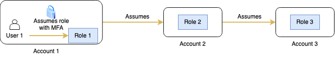

# letme [](https://goreportcard.com/report/github.com/lockedinspace/letme-go)  [](https://pkg.go.dev/github.com/lockedinspace/letme) [](https://opensource.org/licenses/MIT) 

## Requirements
- Go (recommended 1.19 or >= 1.16) installed in your system.
- AWS cli (recommended v2) installed in your system.
## What letme achieves
letme was born in order to have a reliable and fast way to switch between AWS accounts from the cli, as some AWS system administrators found themselves using tools which involved in way too many variables to keep in mind in order to switch between accounts. letme tries to mitigate the hassle that involves using the assume role api, switching between chained roles, etc. From the other hand, it does not tinker with the end-user machine, insted it assumes that the end user knows how to secure their file access, etc. 

letme reads from a common database, so no more: _"From my local computer works."_

It is also mantained and developed under the following statement:

- A simple tool which writes/updates AWS credentials under your AWS files.

This achieves a lightweight, integrity-driven, fast and non-intrusive toolkit that only reads from a DynamoDB database, authenticates the user (if MFA is enabled and AWS authorizes the assume role request) and adds the successful credentials into (``$HOME/.aws/credentials`` and ``$HOME/.aws/config``).

Later on, you can append the  ``--profile example1`` to your AWS cli operations and call resources from within example1's AWS account.
## What it is not
This software is not intended for:

- Securing your AWS files, letme just reads and writes to them. You are responsable to prevent unauthorized access to those files.
- Securing the AWS side (requiring MFA in your trust relationships, using a role with the least amount of privileges, etc.)

## Setting up letme

If your organization has already configured the infrastructure required by letme, you just want to [install letme](#installing-letme). And start using it as soon as you configure the required parameters.

Nevertheless, if want to set up letme for your organization you must spin up the [required infrastructure for letme](#setting-up-the-aws-infrastructure-required-by-letme), once done, you can distribute your configuration file amongst your peers.


### Installing letme
Review the requirements and install letme with:

``go install github.com/lockedinspace/letme@latest``. 

Go will automatically install it in your ``$GOPATH/bin`` directory which should be in your ``$PATH``.

### Installing letme from source
If you wish to install from source, clone the repository and build the executable with ``go build``. Afterwards, you must place the binary into your ``$PATH``.  
This repository uses a ``go mod`` file, so don't git clone inside your ``$GOPATH``.

### Using the configuration file
You will use a configuration file where values such as MFA device arn, DynamoDB table will be provided. A letme config file template looks like:
```
[general]
  aws_source_profile = "default"
  aws_source_profile_region = "eu-west-1"
  dynamodb_table = "mytable"
  mfa_arn = "arn:aws:iam::123456789012:mfa/user001"
  session_name = "user001-with-letme"
```

Run ``letme config-file`` to generate your empty template.

Where:
| Key | Description | Default value | Required | Type |
| ------ | ------ | ------ | ------ | ------ |
| ``aws_source_profile`` | The profile name which stores the source account credentials. This account helds the DynamoDB table as well as being the IAM principal from which the AWS assumed account accepts [[1]](https://docs.aws.amazon.com/IAM/latest/UserGuide/reference_policies_elements_principal.html) | ``default`` | No | ``string`` |
| ``aws_source_profile_region`` | The region name in the source account where the DynamoDB table is located [[2]](https://docs.aws.amazon.com/AWSEC2/latest/UserGuide/using-regions-availability-zones.html) | ``-`` | Yes | ``string`` |
| ``dynamodb_table`` | The DynamoDB table name where the AWS accounts are stored [3](#setting-up-the-aws-infrastructure-required-by-letme) | ``-`` | Yes | ``string`` |
| ``mfa_arn`` | The AWS MFA device arn used to authenticate against AWS [[4]](https://docs.aws.amazon.com/cli/latest/reference/iam/list-mfa-devices.html)  | ``-`` | No (depending on your AWS trust relationship policy) | ``string`` |
| ``session_name`` | The session name which letme uses when assuming a role | ``${account_name}-letme-session`` | No | ``string`` |

### Setting up the AWS infrastructure required by letme

If you want to start using letme for your organization, you must deploy one DynamoDB table under your main AWS account which will be the one
hosting the whole central database for your organization. The DynamoDB table name will be the one used in your configuration file under the ``dynamodb_table`` key.  

When adding a new AWS account, you need to create an item inside the DynamoDB table with the following structure: [AWS account structure](https://github.com/lockedinspace/letme/blob/main/docs/dynamodb_structure.json). Once you create that item, if you perform a ``letme list`` or ``letme init && letme list`` you will be able to list that new account.

Take a look at the following simplified diagram and understand why a DynamoDB table is required in order to provide a central and reliable source of trust.


(_letme workflow_)

Here's a more detailed workflow of the work being done behind the scenes:

When the user tries to obtain access to ``example1``'s account, letme will read the parameters specified in the config file and try to authenticate against AWS (_step 1 from diagram_). 
If the specified keys ``aws_source_profile`` , ``aws_source_profile_region``  and ``dynamodb_table`` map to an existing DynamoDB table, letme will try to get the information stored into the item which its ``"name"`` satisfies ``example1``. 

If the DynamoDB table contains an item entry for example1 with the following [json structure](https://github.com/lockedinspace/letme/blob/main/docs/dynamodb_structure.json), letme will grab the first role from the role list. If the destination account needs to be chained through multiple roles, specify them in order (the latest role to be assumed should be on the lastest position of the json role list) [more information](#multi-account-role-chaining-added-in-v015)

Once letme can retrieve the role, it will request some AWS STS temporary credentials using the [AWS Go SDK](https://aws.amazon.com/es/sdk-for-go/). Note that the request will always come from the account which holds the profile ``aws_source_profile``.

If the IAM role has a multi factor authentication condition: 
```
"Condition": {
    "BoolIfExists": { 
      "aws:MultiFactorAuthPresent" : "true" 
  }
}
```
You will need to set the ``mfa_arn`` to your mfa device for the profile specified under ``aws_source_profile``, afterwards, letme will ask you to provide the mfa token. If the token is valid, you will get the new credentials written or overwritten  (if they already exist from a previous ``letme obtain`` call) (image step 2) and you will be able to call resources (image step 3) from that AWS account (image step 4).

If you wish to cache some queries, you must run ``letme init`` which will create a file containing all of the accounts from your DynamoDB table. This will speed up response times and save you some extra billing at the end of the month. The downside is that you will be working with a copy, so if anyone updates the DynamoDB, you will need to rerun ``letme init`` in order to update your local file against the remote DynamoDB table.
It is recommended to run ``letme init`` before obtaining credentials.

### Multi-account role chaining (added in v0.1.5)

You can also assume a role through a series of accounts. Note the diagram below to clarify. The initiator role (Role 1 in diagram), should only be accesed based on a true multi factor authentication condition (see above). 



Role2 and Role3 iam role's trust relationships should use arn of the previous role as princial. E.g: Role2 trust relationship.

```json
{
    "Version": "2012-10-17",
    "Statement": [
        {
            "Effect": "Allow",
            "Principal": {
                "AWS": "arn:aws:sts::ACCOUNT1:assumed-role/role/role1"
            },
            "Action": [
                "sts:AssumeRole",
                "sts:TagSession"
            ]
        }
    ]
}
```

This approach grants another layer of security, using a bastion aws account to track and centralize assume role requests [[5]](https://docs.aws.amazon.com/STS/latest/APIReference/API_AssumeRole.html). When you create a multi-account role chaining on your DynamoDB table, you should specify the roles in order:

Using the letme account structure, the roles should be placed
```json
{
 "id": 123456789,
 "name": "example1",
 "description": "This is a skeleton for an aws account named example1 which will be assumed through an IAM Role (or a chained IAM role list).",
 "region": [
  "eu-west-1",
  "eu-central-1"
 ],
 "role": [
  "arn:aws:iam::ACCOUNT1:role/role1",
  "arn:aws:iam::ACCOUNT2:role/role2",
  "arn:aws:iam::ACCOUNT3:role/role3"
 ]
}
```
The output from the letme cli, is as follows:
```bash
~ $ letme obtain example1
Using default session name: mySession
More than one role detected. Total hops: 3
[1/3] 
Enter MFA one time pass code: 123456
[2/3] 
[3/3] 
letme: use the argument '--profile example1' to interact with the account.
```
Some important notes regarding this approach are:
- Currently, letme only supports using MFA authentication for the first role.
